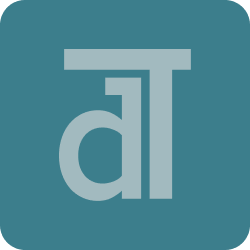

<div align="center">



# Dalet

</div>

Markup language ecosystem сombining small file size, big number of possibilities for describing the interface and readability.

[Specification](./specification/main.md).

> [!WARNING]
> Specification is not complete.

## Concept

This is Daleth (high level language that translates to Daletl).

```yaml
# tag: body
# each line is a new tag (if not {}, () is used)
# body text always trimmed
h[1]: TxtDot revolution
p: TxtDot is a cool project

# If no tag is specified, then the 'element' tag, the most primitive tag, is placed
(
Check Dalet too
This is one paragraph
)

This is another paragraph

# [ ] for argument
row[center]: {
  link[https://github.com/txtdot/txtdot]: Homepage
  btn[https://example.com/donate]: {
    # tag without body
    img[https://example.com/donate.png]
    Donate
  }
}

# {} for multiple objects
row: {
  {
    h[2]: Features

    ul: {
      Server-side page simplification
      Media proxy
      Image compression with Sharp
      Rendering client-side apps (Vanilla, React, Vue, etc) with webder
      Search with SearXNG
      Handy API endpoints
      No client JavaScript
      Some kind of Material Design 3
      Customization with plugins, see @txtdot/sdk and @txtdot/plugins
    }

  }

  {
    h[2]: Running

    {
      h[3]: Dev

      # () for multiline strings, indent is automatically trimmed
      code: (
        npm install
        npm run dev
      )

      # (~n Text) n is number of minimum spaces
      code[markdown]: (~4
        this is codeblock
      )

      # (# Text) Text after "(# " not modified
      code[markdown]: (#     this is codeblock)
    }

    {
      h[3]: Production

      code: (
        npm install
        npm run build
        npm run start
      )
    }

    {
      h[3]: Docker

      code: docker compose up -d
    }

  }
}

# | is delimeter for elements.
# Element | Description == {
#   Element
#   Description
# }
table: {
  Element | Description
  h       | Heading
  p       | Paragraph
  img     | Image
  link    | Link
  btn     | Button
  ul      | Unordered list
  br      | Line break
}
```
